# AquaSense — Real-Time Smart Irrigation Dashboards 

This repository contains a full-stack **smart irrigation** system. IoT end-nodes send measurements over **LoRaWAN** to a gateway, flow through **ChirpStack** and **MQTT**, are stored in **MongoDB**, exposed via a secure **Spring Boot** API, and visualized with an **Angular 20** dashboard.  
Everything runs with **Docker Compose** locally or on **AWS EC2 (Ubuntu)**.

```mermaid
flowchart LR
  subgraph Field
    A["End Node\nSTM32WL55 + IKS01A3"]
    B["LoRaWAN Gateway"]
  end
  subgraph Platform
    C["ChirpStack (EU868)"]
    D["Mosquitto\n(MQTT Broker)"]
    E["mqtt-to-mongo\n(Bridge)"]
    F["MongoDB\n(iot_data.sensors)"]
    G["Spring Boot API\nJWT / RBAC"]
    H["Angular 20 Dashboard\n(SSR)"]
  end
  A -->|LoRa| B
  B -->|UDP/1700| C
  C -->|MQTT pub/sub| D
  D --> E
  E --> F
  F <--> G
  G <--> H

  classDef field fill:#e8f5e9,stroke:#2e7d32,stroke-width:2px,color:#1b5e20;
  classDef plat  fill:#eef7ff,stroke:#1565c0,stroke-width:1.5px,color:#0d47a1;
  classDef db    fill:#efe7fb,stroke:#6a1b9a,stroke-width:2px,color:#4a148c;

  class A,B field;
  class C,D,E,G,H plat;
  class F db;

```

---

## Diagrams

### Class Diagram

  

  
<b>Text summary </b>

  The model centers on **organizations** that *own* many **end-node devices**. Each **EndNodeDevice** (identified by a LoRaWAN **devEUI** and carrying GPS info) **produces** a time-series of **SensorReading** records; this is a composition, so readings exist only for their device. Readings capture the environmental metrics used by the app (temperature, humidity, pressure, soil humidity, luminosity) plus the irrigation command state and timestamp. **Users** sign in to operate the system and are granted permissions through **Roles** (e.g., *ADMIN*, *CLIENT*). Admin users manage organizations and devices; client users primarily view dashboards and device details.

### Use-Case Diagram

  

  
<b>Text summary </b>

  Two main actors interact with the system: the **Client/Farmer** and the **Admin**. Both authenticate, access the **real-time dashboard**, browse **devices**, open **device detail** to see the **latest readings**, **history**, and **map location**. Operators can adjust **thresholds** and send a **manual irrigation command** when allowed. **Admins** additionally manage **users/roles** and **device/organization** records. In the background, AquaSense **ingests uplinks from ChirpStack**, persists them, evaluates rules to **raise alerts**, and exposes the data through the API for the web dashboard.

