# AquaSense — Real-Time Smart Irrigation Dashboards 

This repository contains a full-stack **smart irrigation** system. IoT end-nodes send measurements over **LoRaWAN** to a gateway, flow through **ChirpStack** and **MQTT**, are stored in **MongoDB**, exposed via a secure **Spring Boot** API, and visualized with an **Angular 20** dashboard.  
Everything runs with **Docker Compose** locally or on **AWS EC2 (Ubuntu)**.

```mermaid
flowchart LR
  subgraph Field
    A["End Node\nSTM32WL55 + IKS01A3"]
    B["LoRaWAN Gateway"]
  end
  subgraph Platform
    C["ChirpStack (EU868)"]
    D["Mosquitto\n(MQTT Broker)"]
    E["mqtt-to-mongo\n(Bridge)"]
    F["MongoDB\n(iot_data.sensors)"]
    G["Spring Boot API\nJWT / RBAC"]
    H["Angular 20 Dashboard\n(SSR)"]
  end
  A -->|LoRa| B
  B -->|UDP/1700| C
  C -->|MQTT pub/sub| D
  D --> E
  E --> F
  F <--> G
  G <--> H

  classDef field fill:#e8f5e9,stroke:#2e7d32,stroke-width:2px,color:#1b5e20;
  classDef plat  fill:#eef7ff,stroke:#1565c0,stroke-width:1.5px,color:#0d47a1;
  classDef db    fill:#efe7fb,stroke:#6a1b9a,stroke-width:2px,color:#4a148c;

  class A,B field;
  class C,D,E,G,H plat;
  class F db;

```




---

## Diagrams

### Class Diagram
<p align="center">
  
</p>

<details>
  <summary><b>Text summary </b></summary>

  The model centers on **organizations** that *own* many **end-node devices**. Each **EndNodeDevice** (identified by a LoRaWAN **devEUI** and carrying GPS info) **produces** a time-series of **SensorReading** records; this is a composition, so readings exist only for their device. Readings capture the environmental metrics used by the app (temperature, humidity, pressure, soil humidity, luminosity) plus the irrigation command state and timestamp. **Users** sign in to operate the system and are granted permissions through **Roles** (e.g., *ADMIN*, *CLIENT*). Admin users manage organizations and devices; client users primarily view dashboards and device details.

</details>


### Use-Case Diagram
<p align="center">
  
</p>

<details>
  <summary><b>Text summary </b></summary>

  Two main actors interact with the system: the **Client/Farmer** and the **Admin**. Both authenticate, access the **real-time dashboard**, browse **devices**, open **device detail** to see the **latest readings**, **history**, and **map location**. Operators can adjust **thresholds** and send a **manual irrigation command** when allowed. **Admins** additionally manage **users/roles** and **device/organization** records. In the background, AquaSense **ingests uplinks from ChirpStack**, persists them, evaluates rules to **raise alerts**, and exposes the data through the API for the web dashboard.

</details>

---

## 1) Project Structure

```text
.
├─ chirpstack/                 # LoRaWAN network server bundle
├─ db/                         # Data pipeline & Mongo helpers
└─ web/
   ├─ backEnd/                 # Spring Boot API (Java 21, JWT/RBAC)
   │  ├─ src/main/java/...     # controllers, services, models (EndNodeDevice, SensorReading, User, Role)
   │  ├─ src/main/resources/   # application.properties / YAML
   │  └─ pom.xml               # Maven project descriptor
   └─ frontEnd/                # Angular 20 dashboard (SSR + Vite)
      ├─ src/app/              # feature modules, components (Dashboard, Devices, Auth)
      ├─ src/assets/           # images, styles
      ├─ package.json          # npm scripts & deps
      └─ angular.json          # Angular workspace config

```

## 2) IoT

**Hardware**
- **End node:** STM32WL55JC1 (LoRa) + **X-NUCLEO-IKS01A3** (temperature / humidity / pressure)
- **Location:** GPS coordinates stored with each device (lat, lng, alt).
- **Power/Join:** LoRaWAN **OTAA** (secure join).

**Uplinks**
- Region/plan: **EU868**
- **FPort:** `2`
- **Payload format:** **CayenneLPP**
- **DevEUI:** normalized to **lowercase hex (no separators)** across MQTT, DB, and API.

**Measured metrics**
- Atmospheric: **temperature**, **humidity**, **pressure**
- **Soil humidity** (from irrigation probe)
- **Irrigation command** state (digital input 0/1)
- **Illuminance**
- **GPS** (lat/lon/alt)

**CayenneLPP channel mapping**

| Channel | Sensor/Data Type            | Unit / Note            |
|:------:|------------------------------|-------------------------|
| `0`    | GPS (lat, lon, alt)          | degrees / meters       |
| `1`    | Barometric pressure          | hPa                    |
| `2`    | Temperature                  | °C                     |
| `3`    | Relative humidity            | %                      |
| `4`    | Illuminance                  | lux (optional)         |
| `5`    | Analog input (soil probe)    | raw / % (normalized)   |
| `6`    | Digital input (irrigation)   | 0/1                    |

**Decoded payload (example)**
```json
{
  "illuminanceSensor": { "4": 0 },
  "barometer":        { "1": 1016 },
  "analogInput":      { "5": 12 },
  "humiditySensor":   { "3": 58 },
  "digitalInput":     { "6": 1 },
  "gpsLocation": {
    "0": { "altitude": 0, "longitude": 10.6345, "latitude": 35.8245 }
  },
  "temperatureSensor": { "2": 30 }
}
```
---

## 3) ChirpStack (Gateway & MQTT) — Concepts, Setup, Verification

> **What this layer does**  
> LoRaWAN devices send uplinks to a **gateway** (Semtech UDP). The gateway forwards to **ChirpStack**, which validates/decodes payloads and **publishes** events to **MQTT (Mosquitto)**. Everything downstream (our bridge, DB, API/UI) reads from MQTT.

### 3.1 Architecture & Data Path
- **Gateway** → Semtech UDP packet forwarder → **ChirpStack host IP** on **UDP/1700**  
- **ChirpStack** → handles LoRaWAN join/MIC/ADR and **publishes uplinks** to MQTT  
- **MQTT (Mosquitto)** → event bus our ingestion service subscribes to  
- **Conventions we enforce**
  - `DevEUI` is **lowercase hex** (no separators) across ChirpStack, MQTT, and Mongo  
  - Application data uses **FPort = 2** (others ignored by the bridge unless explicitly enabled)

### 3.2 Gateway configuration (Semtech UDP)
- **Server/IP**: the **host IP** running ChirpStack (do **not** use `localhost` on the gateway)
- **Port**: `1700/udp`
- **Region**: `EU868` (matches device firmware and ChirpStack region file)

**Open firewall (examples)**  
Windows:
~~~powershell
netsh advfirewall firewall add rule name="LoRa UDP" dir=in action=allow protocol=udp localport=1700
~~~
Linux (ufw):
~~~bash
sudo ufw allow 1700/udp
~~~

### 3.3 ChirpStack setup (UI)
- **Region/Plan**: `EU868`  
- **Provisioning path**: `Tenant → Application → Device Profile (Class A) → Device (DevEUI)`  
- **Join method**: **OTAA** (recommended)  
- **Integration**: **MQTT** (broker = **Mosquitto** in our stack)  
- **Web UI**: `http://<host>:8085`  

> **Tip:** keep a note of `application_id` and always paste the **DevEUI in lowercase** when testing topics/filters.

### 3.4 Troubleshooting & Verification
- **No joins** → check gateway points to the **correct host IP**, UDP/1700 open, device keys (AppEUI/AppKey) correct, gateway has **NTP**
- **No uplinks** → subscribe to `chirpstack/#` and check **Device → Events** in the UI
- **DevEUI mismatch** → ensure the same **lowercase** EUI is used in UI, topics, and DB
- **Checklist**
  - Gateway **connected**, region **EU868**
  - Device **joined (OTAA)** and appears under the Application
  - Uplinks arrive on **FPort 2**
  - `mosquitto_sub` shows messages on expected topics

### 3.5 Security notes
- Don’t expose **Mosquitto** publicly; keep it on a private Docker network
- For using ChirpStack REST, rotate tokens and store in `.env`:
~~~dotenv
CHIRPSTACK_API_TOKEN=REPLACE_ME
CHIRPSTACK_API_URL=http://chirpstack:8085/api
~~~

### 3.6 Captures (replace with your screenshots)
```html
<p align="center">
  <br/>
  <em>Tenant & Application setup</em>
</p>
<p align="center">
  <br/>
  <em>Device Events – verify join/uplink before moving on</em>
</p>
```


