# AquaSense — Real-Time Smart Irrigation Dashboards 

This repository contains a full-stack **smart irrigation** system. IoT end-nodes send measurements over **LoRaWAN** to a gateway, flow through **ChirpStack** and **MQTT**, are stored in **MongoDB**, exposed via a secure **Spring Boot** API, and visualized with an **Angular 20** dashboard.  
Everything runs with **Docker Compose** locally or on **AWS EC2 (Ubuntu)**.

```mermaid
flowchart LR
  subgraph Field
    A["End Node\nSTM32WL55 + IKS01A3"]
    B["LoRaWAN Gateway"]
  end
  subgraph Platform
    C["ChirpStack (EU868)"]
    D["Mosquitto\n(MQTT Broker)"]
    E["mqtt-to-mongo\n(Bridge)"]
    F["MongoDB\n(iot_data.sensors)"]
    G["Spring Boot API\nJWT / RBAC"]
    H["Angular 20 Dashboard\n(SSR)"]
  end
  A -->|LoRa| B
  B -->|UDP/1700| C
  C -->|MQTT pub/sub| D
  D --> E
  E --> F
  F <--> G
  G <--> H

  classDef field fill:#e8f5e9,stroke:#2e7d32,stroke-width:2px,color:#1b5e20;
  classDef plat  fill:#eef7ff,stroke:#1565c0,stroke-width:1.5px,color:#0d47a1;
  classDef db    fill:#efe7fb,stroke:#6a1b9a,stroke-width:2px,color:#4a148c;

  class A,B field;
  class C,D,E,G,H plat;
  class F db;

```

---

## Diagrams

> The diagrams below are created in **draw.io (diagrams.net)**.  
> Editable sources live in `docs/diagrams/*.drawio`, and the README embeds the exported **SVG** versions.

### Class Diagram

  

  
<b>Text summary (quick reference)</b>

  **Entities:** User, Role, Organization, EndNodeDevice, SensorReading  
  **Key relations:** Organization 1—0..* EndNodeDevice (owns) • EndNodeDevice 1 ◼— 0..* SensorReading (produces) • User 0..*—0..* Role (has) • User 1—0..* EndNodeDevice (manage)

---

### Use-Case Diagram

  

  
<b>Text summary (actors & main cases)</b>

  **Actors:** Client, Admin  
  **Main use cases:** Authenticate, View Real-Time Dashboard, Manage Devices, Manage Organizations, Manage Users, Send Irrigation Command (Manual). :contentReference[oaicite:0]{index=0}

