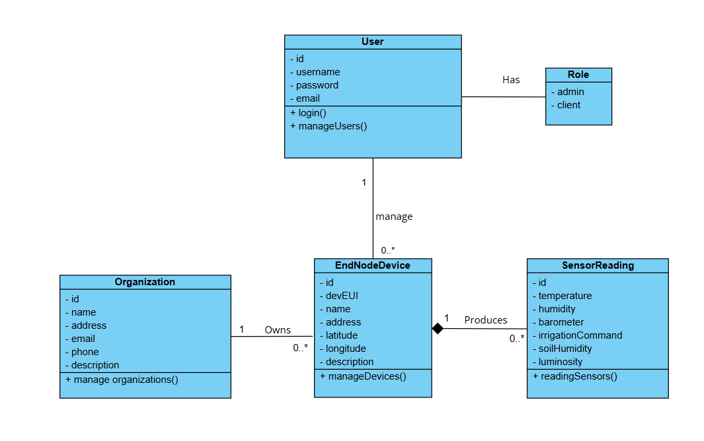

# AquaSense — Real-Time Smart Irrigation Dashboards 

This repository contains a full-stack **smart irrigation** system. IoT end-nodes send measurements over **LoRaWAN** to a gateway, flow through **ChirpStack** and **MQTT**, are stored in **MongoDB**, exposed via a secure **Spring Boot** API, and visualized with an **Angular 20** dashboard.  
Everything runs with **Docker Compose** locally or on **AWS EC2 (Ubuntu)**.


## Architecture Overview

<p align="center">
  
</p>


---

## Proposed Solution

### 1) Problem Analysis
- **Context.** Manual or timer-based irrigation wastes water and ignores real field conditions (soil, weather, light).
- **Pain points.** Need real-time visibility (temperature, humidity, soil moisture, pressure, luminosity), device geolocation, and the ability to **act** (irrigation command) with traceability.
- **Field constraints.** Poor connectivity in rural areas, limited power, low latency needs, end-to-end security.
- **Objective.** Build an end-to-end chain **IoT → LoRaWAN Gateway → ChirpStack → MQTT → MongoDB → Spring Boot API → Angular Dashboard**, multi-tenant and secured with **JWT/RBAC**, to **observe**, **decide**, and **control**.

### 2) Diagrams

### Class Diagram
<p align="center">
  
</p>

<details>
  <summary><b>Text summary </b></summary>

  The model centers on **organizations** that *own* many **end-node devices**. Each **EndNodeDevice** (identified by a LoRaWAN **devEUI** and carrying GPS info) **produces** a time-series of **SensorReading** records; this is a composition, so readings exist only for their device. Readings capture the environmental metrics used by the app (temperature, humidity, pressure, soil humidity, luminosity) plus the irrigation command state and timestamp. **Users** sign in to operate the system and are granted permissions through **Roles** (e.g., *ADMIN*, *CLIENT*). Admin users manage organizations and devices; client users primarily view dashboards and device details.

</details>


### Use-Case Diagram
<p align="center">
  
</p>

<details>
  <summary><b>Text summary </b></summary>

  Two main actors interact with the system: the **Client** and the **Admin**. Both authenticate, access the **real-time dashboard**, browse **devices**, open **device detail** to see the **latest readings**, **history**, and **map location**. Operators can adjust **thresholds** and send a **manual irrigation command** when allowed. **Admins** additionally manage **users/roles** and **device/organization** records. In the background, AquaSense **ingests uplinks from ChirpStack**, persists them, and exposes the data through the API for the web dashboard.

</details>

---

## 1) Project Structure

```text

├─ chirpstack/                 # LoRaWAN network server bundle
│  ├─ .env/                    # Parameters for the ChirpStack stack
│  └─ docker-compose.yml       # Launches the **ChirpStack bundle**
├─ db/                         # Data pipeline & Mongo helpers
│  ├─ requirements.txt         # Python deps for the ingestion bridge (paho-mqtt, pymongo, etc.).
│  ├─ .env/                    # Ingestion and database connection settings (MQTT host/topic, Mongo URI).
│  └─ docker-compose.yml       # Spins MongoDB, Mongo-Express (UI), and the mqtt_to_mongo bridge service.
└─ web/
   ├─ backEnd/                 # Spring Boot API (Java 21, JWT/RBAC)
   │  ├─ src/main/java/...     # controllers, services, models (EndNodeDevice, SensorReading, User, Role)
   │  ├─ src/main/resources/   # application.properties / YAML
   │  ├─ pom.xml               # Maven project descriptor
   │  └─ Dokerfile.backend     # Multi-stage Spring Boot (Java 21) build
   ├─ frontEnd/                # Angular 20 dashboard (SSR + Vite)
   │  ├─ src/app/              # feature modules, components (Dashboard, Devices, Auth)
   │  ├─ src/assets/           # images, styles
   │  ├─ package.json          # npm scripts & deps
   │  ├─ angular.json          # Angular workspace config
   │  └─ Dokerfile.ssr         # Two-stage Angular 20 build
   ├─ .env/                    # Centralizes API & UI configuration used by both containers (and/or injected by compose)
   └─ docker-compose.yml       # Orchestrates two services (frontend + backend), builds from the Dockerfiles above

```

## 2) IoT

**Hardware**
- **End node:** STM32WL55JC1 (LoRa) + **X-NUCLEO-IKS01A3** (temperature / humidity / pressure)
- **Location:** GPS coordinates stored with each device (lat, lng, alt).
- **Power/Join:** LoRaWAN **OTAA** (secure join).

**Uplinks**
- Region/plan: **EU868**
- **FPort:** `2`
- **Payload format:** **CayenneLPP**
- **DevEUI:** normalized to **lowercase hex (no separators)** across MQTT, DB, and API.

**Measured metrics**
- Atmospheric: **temperature**, **humidity**, **pressure**
- **Soil humidity** (from irrigation probe)
- **Irrigation command** state (digital input 0/1)
- **Illuminance**
- **GPS** (lat/lon/alt)

**CayenneLPP channel mapping**

| Channel | Sensor/Data Type            | Unit / Note            |
|:------:|------------------------------|-------------------------|
| `0`    | GPS (lat, lon, alt)          | degrees / meters       |
| `1`    | Barometric pressure          | hPa                    |
| `2`    | Temperature                  | °C                     |
| `3`    | Relative humidity            | %                      |
| `4`    | Illuminance                  | lux (optional)         |
| `5`    | Analog input (soil probe)    | raw / % (normalized)   |
| `6`    | Digital input (irrigation)   | 0/1                    |

**Decoded payload (example)**
```json
{
  "illuminanceSensor": { "4": 0 },
  "barometer":        { "1": 1016 },
  "analogInput":      { "5": 12 },
  "humiditySensor":   { "3": 58 },
  "digitalInput":     { "6": 1 },
  "gpsLocation": {
    "0": { "altitude": 0, "longitude": 10.6345, "latitude": 35.8245 }
  },
  "temperatureSensor": { "2": 30 }
}
```
---

## 3) ChirpStack (Gateway & MQTT) — Concepts, Setup, Verification

> **What this layer does**  
> LoRaWAN devices send uplinks to a **gateway** (Semtech UDP). The gateway forwards to **ChirpStack**, which validates/decodes payloads and **publishes** events to **MQTT (Mosquitto)**. Everything downstream (our bridge, DB, API/UI) reads from MQTT.

### 3.1 Architecture & Data Path
- **Gateway** → Semtech UDP packet forwarder → **ChirpStack host IP** on **UDP/1700**  
- **ChirpStack** → handles LoRaWAN join/MIC/ADR and **publishes uplinks** to MQTT  
- **MQTT (Mosquitto)** → event bus our ingestion service subscribes to  
- **Conventions we enforce**
  - `DevEUI` is **lowercase hex** (no separators) across ChirpStack, MQTT, and Mongo  
  - Application data uses **FPort = 2** (others ignored by the bridge unless explicitly enabled)

### 3.2 Gateway configuration (Semtech UDP)
- **Server/IP**: the **host IP** running ChirpStack (do **not** use `localhost` on the gateway)
- **Port**: `1700/udp`
- **Region**: `EU868` (matches device firmware and ChirpStack region file)

**Open firewall (examples)**  
Windows:
~~~powershell
netsh advfirewall firewall add rule name="LoRa UDP" dir=in action=allow protocol=udp localport=1700
~~~
Linux (ufw):
~~~bash
sudo ufw allow 1700/udp
~~~

### 3.3 ChirpStack setup (UI)
- **Region/Plan**: `EU868`  
- **Provisioning path**: `Tenant → Application → Device Profile (Class A) → Device (DevEUI)`  
- **Join method**: **OTAA** (recommended)  
- **Integration**: **MQTT** (broker = **Mosquitto** in our stack)  
- **Web UI**: `http://<host>:8085` 

> **Tip:** keep a note of `application_id` and always paste the **DevEUI in lowercase** when testing topics/filters.

### 3.4 Troubleshooting & Verification
- **No joins** → check gateway points to the **correct host IP**, UDP/1700 open, device keys (AppEUI/AppKey) correct, gateway has **NTP**
- **No uplinks** → subscribe to `chirpstack/#` and check **Device → Events** in the UI
- **DevEUI mismatch** → ensure the same **lowercase** EUI is used in UI, topics, and DB
- **Checklist**
  - Gateway **connected**, region **EU868**
  - Device **joined (OTAA)** and appears under the Application
  - Uplinks arrive on **FPort 2**
  - `mosquitto_sub` shows messages on expected topics

### 3.5 Security notes
- Don’t expose **Mosquitto** publicly; keep it on a private Docker network
- For using ChirpStack REST, rotate tokens and store in `.env`:
~~~dotenv
CHIRPSTACK_API_TOKEN=REPLACE_ME
CHIRPSTACK_API_URL=http://chirpstack:8085/api
~~~

### 3.6 Captures (replace with your screenshots)

**Verify uplinks in UI (Events tab):**
<p align="center">
  
</p>


---

## 4) Database & Ingestion (MongoDB + mqtt_to_mongo)

> **Purpose**  
> Persist decoded uplinks from ChirpStack into **MongoDB** using a lightweight Python bridge (**mqtt_to_mongo**). Inspect and validate data with **Mongo-Express**.


### 4.1 Services
- **MongoDB** — time-series store (DB: `iot_data`, collection: `sensors`)  
- **Mongo-Express** — web admin at `http://<host>:8083`  
- **mqtt_to_mongo** — Python service subscribing to ChirpStack MQTT topics and inserting normalized documents


### 4.2 Document shape (inserted by `mqtt_to_mongo.py`)
~~~json
{
  _id: ObjectId('68c1c1b6f1720d4e739ef6f0'),
    application_id: 'c037b967-a03a-4553-9dee-35f103f27621',
    dev_eui: '008000e100000000',
    f_port: 2,
    data: 'AIgFd2UBn2kAAAABcyeSAmcBIgNonARlAQoFAgSwBgAB',
    rx_info: [
        {
            gatewayId: 'a840411d1fdc4150',
            uplinkId: 44024,
            gwTime: '2025-09-10T18:21:42.340632+00:00',
            nsTime: '2025-09-10T18:21:42.397573624+00:00',
            rssi: -72,
            snr: 10.2,
            channel: 3,
            location: {},
            context: '9/P6Sw==',
            crcStatus: 'CRC_OK'
        }
    ],
    object_json: {
        analogInput: {
            '5': 12
        },
        illuminanceSensor: {
            '4': 266
        },
        humiditySensor: {
            '3': 78
        },
        barometer: {
            '1': 1013
        },
        gpsLocation: {
            '0': {
                altitude: 0,
                longitude: 10.6345,
                latitude: 35.8245
            }
        },
        temperatureSensor: {
            '2': 29
        },
        digitalInput: {
            '6': 1
        }
    },
    timestamp: ISODate('2025-09-10T18:21:42.606Z')
}
~~~

<p align="center">
  
</p>


### 4.3 Troubleshooting
- **No documents**  
  • Verify gateway → ChirpStack host IP (UDP/1700 open)  
  • Check ChirpStack **Device → Events** for joins/uplinks  
  • Confirm the bridge subscribes to the right topic (`chirpstack/#` or app-specific)  
  • Tail logs:
  ~~~bash
  docker compose logs -f mqtt_to_mongo
  ~~~
- **DevEUI mismatches** → ensure **lowercase** in ChirpStack, MQTT topics, and DB  
- **Wrong fields** → adjust channel→field mapping inside `mqtt_to_mongo.py`

## Web 

The **Web layer** turns ingested IoT data into a secure, responsive user experience.  
It consists of a **Spring Boot** REST API  and an **Angular 20** dashboard , both containerized with Docker.

---

### 1.1) Architecture at a Glance
| Tier            | Tech / Tool                          | Purpose |
|-----------------|--------------------------------------|---------|
| Frontend        | Angular  (20)                        | UI, charts, maps, auth, device/history views |
| Backend         | Spring Boot (Java 21)                | REST API, auth, business logic |
| Database        | MongoDB                              | Time-series readings (`iot_data.sensors`) |
| Messaging (upstream) | Mosquitto (MQTT), ChirpStack   | Already ingested by bridge; **Web reads from MongoDB** |
| Auth            | JWT (access + refresh), RBAC         | ADMIN / CLIENT |
| Containerization| Dockerfiles + Docker Compose         | Local & cloud deployment (e.g., EC2) |

---

### 1.2) Data Flow (Web perspective)
**MongoDB → Spring Boot API → Angular UI**  
The API exposes device metadata and readings from MongoDB; the UI consumes `/api/*` endpoints and renders dashboards, trends, and maps.

---

### 2) Backend Services (Spring Boot)

#### 2.1) Key Endpoints (prefix `/api`)
| Endpoint                                                                 | Method | Auth  | Notes |
|--------------------------------------------------------------------------|:------:|:-----:|------|
| `/auth/login` → `{accessToken, refreshToken}`                            | POST   | Open  | Login with credentials |
| `/auth/refresh` → new access token                                       | POST   | Open  | Uses refresh token |
| `/orgs` / `/orgs/{id}`                                                   | GET    | Any   | List / read Orgs |
| `/orgs` / `/orgs/{id}`                                                   | POST/PUT/DELETE | ADMIN | Manage Orgs |
| `/devices?orgId=<id>` , `/devices/{id}`                                  | GET    | Any   | List / read Devices |
| `/devices` / `/devices/{id}`                                             | POST/PUT/DELETE | Any   | Manage Devices |
| `/readings/latest?devEui=<hex>`                                          | GET    | Any   | Latest sample for device |
| `/readings?devEui=<hex>&since=<ISO>&until=<ISO>&limit=200&sort=ts:desc` | GET    | Any   | Time-window query |
| `/actuator/health`, `/actuator/info`                                     | GET    | Any   | Health/Info |


---

### 3) User Interface (Frontend features)
- **Landing & Auth**: org selection, login; JWT-based sessions.
- **Dashboard**: live tiles (temperature, humidity, pressure, soil humidity, luminosity, irrigation state) with last-update timestamp.
- **Devices**: list/search, device detail (latest + sparkline/history, GPS pin, metadata).
- **History**: charts + paged table; filter by date range.
- **Admin** (role-gated): manage organizations, devices, and users/roles.


---

### 3.1) Roles & Permissions
| Feature                         | CLIENT | ADMIN |
|---------------------------------|:------:|:-----:|
| View dashboards & device data   |   ✓    |  ✓    |
| View history & maps             |   ✓    |  ✓    |
| Manage devices                  |   ✓    |  ✓    |
| Manage organizations            |        |  ✓    |
| Manage users/roles              |        |  ✓    |

---

## Screenshots

<p align="center">
  
  <br><em><b>Landing</b> — Server-side rendered welcome screen with organization selector. Users choose their org before proceeding to the secure portal.</em>
</p>

<p align="center">
  
  <br><em><b>Login</b> — Simple, focused sign-in form. Credentials are exchanged for short-lived access tokens and refresh tokens (JWT).</em>
</p>

<p align="center">
  
  <br><em><b>Admin Dashboard</b> — Multi-tenant sidebar, device inventory, online/offline counters, and live tiles for soil humidity, luminosity, humidity, barometer, temperature, and irrigation state. One-click manual irrigation control (Open/Close) is role-gated.</em>
</p>

<p align="center">
  
  <br><em><b>Device Metrics</b> — Compact cards display the latest readings with units and a “Live” timestamp. Values are pulled via the Spring Boot API from MongoDB.</em>
</p>

<p align="center">
  
  <br><em><b>Geo View</b> — Interactive Leaflet map with a color legend. Toggle between <i>Instant Value</i>, <i>Today’s Low</i>, and <i>Today’s High</i> to visualize spatial patterns.</em>
</p>

<p align="center">
  
  <br><em><b>Device Map</b> — Per-device modal with precise location, popup showing DevEUI, last measurement, and timestamp, plus a summary panel for all key sensors.</em>
</p>

<p align="center">
  
  <br><em><b>Range Explorer</b> — Time-window analytics with date pickers, granularity (e.g., daily), Min/Avg/Max overlays, optional realtime mode, and one-click CSV export.</em>
</p>

---
# Setup — Local (Docker Desktop) & Cloud (AWS EC2 Ubuntu)

This guide covers **both ways** to run the project end-to-end:  
**(A)** on laptop with **Docker Desktop**, and **(B)** on **AWS EC2 (Ubuntu)** with Docker + Docker Compose.

---

## 1) Prerequisites

- **Git** ≥ 2.30  
- **Docker** + **Docker Compose**
  - Windows/macOS: **Docker Desktop**
  - Linux: Docker Engine + Compose plugin

---
## 2) Portainer (Local & Linux/EC2)

> Portainer gives you a web UI to deploy and manage the three stacks in this repo
> (`chirpstack`, `db`, `web`). It works on **Docker Desktop (Windows/macOS)** and **Linux/EC2**.
> Install & start Portainer **before** you bring up the stacks.

### Quick install (same command for Local & Linux)

```bash
# Create persistent volume and run Portainer Community Edition
docker volume create portainer_data
docker run -d \
  --name portainer \
  --restart=unless-stopped \
  -p 9443:9443 \
  -v /var/run/docker.sock:/var/run/docker.sock \
  -v portainer_data:/data \
  portainer/portainer-ce:latest
  ```
---
## 3) Clone the Repository

~~~bash
git https://github.com/mariemm1/IoTIrrigation.git
cd IoTIrrigation
~~~

---

## 4) Environment Configuration (What to create & where)

Create **three** `.env` files with the following minimal content (extend as needed).

### 4.1) `chirpstack/.env`
~~~dotenv
MONGO_USERNAME=<choose_name>
MONGO_PASSWORD=<choose_password>
MONGO_HOST=<choose_host_name>
MONGO_PORT=27017
MONGO_DB=iot_data
MONGO_COLLECTION=sensors
ME_WEB_USERNAME=<coose_user_name>
ME_WEB_PASSWORD=<choose_password>

# Note: Your LoRaWAN gateway must forward to THIS HOST IP on UDP/1700
~~~

### 4.2) `db/.env`  (ingestion → database)
~~~dotenv
# MQTT subscription from ChirpStack

MONGO_USERNAME=<choose_name>
MONGO_PASSWORD=<choose_password>
MONGO_HOST=<choose_host_name>
MONGO_PORT=27017
MONGO_DB=iot_data
MONGO_COLLECTION=sensors
ME_WEB_USERNAME=<choose_name>
ME_WEB_PASSWORD=<choose_password>

~~~

### 4.3) `web/.env`  (API + UI config)
~~~dotenv
# --- Backend admin/bootstrap ---
SERVER_PORT=8081

APP_ADMIN_USERNAME=<choose_userName>
APP_ADMIN_PASSWORD=<choose_password>
APP_ADMIN_EMAIL=<choose_address_email>

APP_BOOTSTRAP_ORG_NAME=<choose_ORG_Name>
APP_BOOTSTRAP_ORG_ADDRESS=<choose_address>
APP_BOOTSTRAP_ORG_EMAIL=<choose_ORG_Email>
APP_BOOTSTRAP_ORG_PHONE=<choose_ORG_Phone>

# --- Mongo ---
MONGO_USERNAME=<choose_name>
MONGO_PASSWORD=<choose_password>
MONGO_HOST=<choose_host_name>
MONGO_PORT=27017
MONGO_DB=iot_data
MONGO_COLLECTION=sensors

# --- ChirpStack ---
CHIRPSTACK_API_BASE_URL=http://chirpstack-rest-api:8090
CHIRPSTACK_API_TOKEN=<API_KEY>
~~~

---

## 5) Local Run (Docker Desktop) — First-boot order

> Start stacks **in this order** the first time so upstream services are ready for downstream consumers.

### 5.1) Start ChirpStack stack
~~~bash
cd chirpstack
docker compose up -d
# UI: http://localhost:8085
~~~
- In the UI: create **Tenant → Application → Device Profile (Class A) → Device (DevEUI)**.
- Make sure your **LoRaWAN gateway** forwards to **your PC’s IP** on **UDP/1700** (do **not** use `localhost` on the gateway device).

### 5.2) Start Data stack (Mongo, Mongo-Express, Mosquitto, mqtt_to_mongo)
~~~bash
cd ../db
docker compose up -d
# Mongo-Express: http://localhost:8083
~~~

### 5.3) Start Web stack (Backend API + Frontend SSR)
~~~bash
cd ../web
docker compose up -d --build
# Frontend (SSR): http://localhost:4200
# Backend API:     http://localhost:8081   
~~~

---

## 6) Cloud Run (AWS EC2 Ubuntu)

### 6.1) Prepare the EC2 host (Ubuntu 22.04+)

1. Launch an **EC2 (Ubuntu)**. In the **Security Group**, allow required ports.
2. Install Docker & Compose:

~~~bash
sudo apt-get update
sudo apt-get install -y ca-certificates curl gnupg
sudo install -m 0755 -d /etc/apt/keyrings
curl -fsSL https://download.docker.com/linux/ubuntu/gpg | sudo gpg --dearmor -o /etc/apt/keyrings/docker.gpg
echo "deb [arch=$(dpkg --print-architecture) signed-by=/etc/apt/keyrings/docker.gpg] https://download.docker.com/linux/ubuntu \
$(. /etc/os-release; echo $VERSION_CODENAME) stable" | sudo tee /etc/apt/sources.list.d/docker.list >/dev/null
sudo apt-get update
sudo apt-get install -y docker-ce docker-ce-cli containerd.io docker-buildx-plugin docker-compose-plugin
sudo usermod -aG docker $USER
newgrp docker
~~~

### 6.2) Deploy code & env files

~~~bash
git clone https://github.com/mariemm1/IoTIrrigation.git
cd IoTIrrigation

# Create the three .env files as in Section 3:
# chirpstack/.env, db/.env, web/.env
~~~

### 6.3) Start stacks (same order as local)

~~~bash
cd chirpstack && docker compose up -d
cd ../db      && docker compose up -d
cd ../web     && docker compose up -d --build
~~~

### 6.4) Point the LoRaWAN gateway
- Configure the **packet forwarder** to the **EC2 public IP** on **UDP/1700**.
  
> Route `/* → frontend:4200`, and `/api/* → backend:8081`. Keep Mosquitto & Mongo on **private** Docker networks.

---

## 7) Verify the Setup

1. **ChirpStack Events** — `http://<host>:8085` → Device → **Events**  
   Expect **Join** then **Up** events on **FPort 2** when your device transmits.


2. **Database** — `http://<host>:8083` → DB **iot_data** → collection **sensors**  
   New documents should appear as uplinks are ingested.


3. **Frontend** — `http://<host>:4200` → Login → Dashboard / Devices / Map / History.

---

## 8) Troubleshooting (Quick fixes)

- **No joins/uplinks in ChirpStack**  
  Gateway must target the **host IP** on **UDP/1700** (never `localhost` on the gateway).  
  Verify AppEUI/AppKey; ensure gateway time (NTP) is correct.

- **Bridge writes nothing to Mongo**  
  Confirm `MQTT_TOPIC` in `db/.env` matches what ChirpStack publishes.  
  Check logs: `docker compose logs -f mqtt_to_mongo` (from `db/` folder).

- **CORS/401 in UI**  
  Add your SSR origin to `CORS_ALLOWED_ORIGINS`.  
  Ensure requests include `Authorization: Bearer <jwt>`.

- **DevEUI mismatches**  
  Always use **lowercase hex** across UI, MQTT topics, and DB.

---

## 9) Port Matrix (Cheat-sheet)

| Service            | Container Port | Host Port (default) | Purpose                              |
|--------------------|----------------|----------------------|--------------------------------------|
| Frontend (SSR)     | **4000**       | 4200                 | Angular Universal server             |
| Backend API        | **8081**       | 8081                 | Spring Boot `/api/*`, `/actuator/*`  |
| ChirpStack UI      | **8085**       | 8085                 | Provision apps/devices               |
| Mosquitto (MQTT)   | **1883**       | 1883                 | Pub/sub bus                          |
| Gateway Forwarder  | **1700/udp**   | 1700/udp             | LoRaWAN gateway → ChirpStack         |
| Mongo-Express      | **8083**       | 8083                 | DB admin UI                          |
| MongoDB            | **27017**      | 27017                | Database endpoint                    |

---

## 10) Useful Commands

~~~bash
# Build & start all (current folder)
docker compose up -d --build

# Follow logs
docker compose logs -f
docker compose logs -f backend
docker compose logs -f frontend
docker compose logs -f mqtt_to_mongo

# Stop & remove containers (keep volumes)
docker compose down

# Full reset (⚠️ removes volumes/data)
docker compose down -v
~~~

> With this setup, **Local (Docker Desktop)** and **Cloud (EC2 Ubuntu)** follow the same `.env + compose` flow.  
> The only external dependency is your **LoRaWAN gateway**, which must point to the host running ChirpStack on **UDP/1700**.
